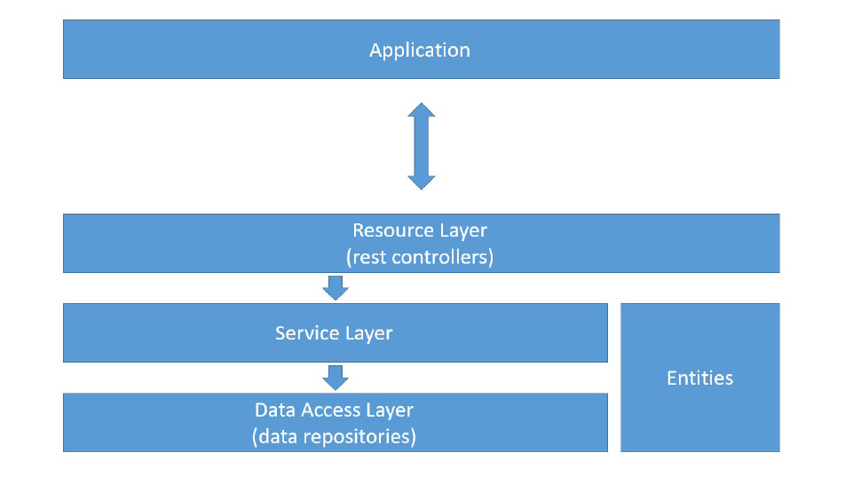
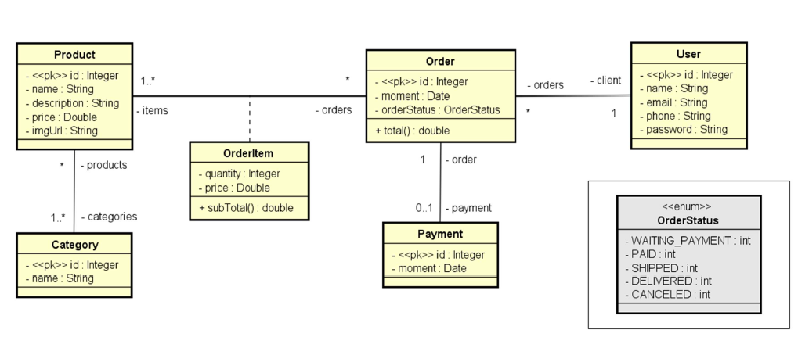

<!-- PROJECT LOGO -->
<br />
<div align="center">
  <a href="https://github.com/othneildrew/Best-README-Template">
    
  </a>

<h1 align="center">Webservice Store Project</h1>

  <p align="center">
    Projeto de webservice de uma loja com SpringBoot!
</div>

<details>
  <summary>Tabela de conteúdos</summary>
  <o
    <li>
      <a href="#sobre-o-projeto">Sobre o projeto</a>
      <ul>
         <li><a href="#padrao-de-camadas">Padrão de camadas</a></li>
         <li><a href="#diagrama-uml">Diagrama UML</a></li>
      </ul>
    </li>
    <li>
      <a href="#tecnologiasferramentas-usadas">Tecnologias/Ferramentas usadas</a>
    </li>
    <li>
      <a href="#como-iniciar-o-projeto">Como iniciar o projeto</a>
      <ul>
        <li><a href="#pre-requisitos">Pré-requisitos</a></li>
        <li><a href="#instalacao">Instalação</a></li>
         <li><a href="#utilizando">Utilizando</a></li>
      </ul>
    </li>
    <li><a href="#conhecimentos-adquiridos-e-melhorias">Conhecimentos Adquiridos e melhorias</a></li>
    <li><a href="#contato">Contato</a></li>
  </ol>
</details>


## :mag_right: Sobre o projeto
O projeto é a construção de um Web Service utilizando a linguagem Java versão 17 e o framework SpringBoot versão 3 para uma Loja. O objetivo foi criar uma aplicação backend utilizando as boas práticas e o padrão API Rest, possibilitando através dos seus endpoints realizar as operações CRUD para as principais entidades da base de dados: usuários, produtos, categorias e pedidos.

Características do projeto:
* Lógica de camadas.
* API no padrão REST.
* Documentação completa com ferramenta SpringDoc Open Api (Swagger).
* Perfil de teste (utilizado banco de dados em memória H2 para facilitação do desenvolvimento).
* Perfil de homologação (utilização de Docker com banco de dados Postgresql e ferramenta pgAdmin).
* Perfil de produção (utilização de ferramenta Render e deploy de imagem da aplicação e banco executando em nuvem).

Por utilizar 3 perfis o projeto possibilita aplicar diferentes ferramentas e técnicas, para a construção de uma aplicação que utiliza a lógica de camadas (Recursos, Serviços e Repositórios).

### Padrão de camadas


A ilustração acima que detalha como funciona a comunicação e transmissão de dados entre as camadas da aplicação. Uma aplicação que irá consumir a API, como por exemplo o navegador Google Chrome, Postman ou outros realiza a requisição a camada de recursos (Resource Layer), essa camada onde tem os controladores Rest, essas classes irão realizar a chamada do método especifico para uma classe de serviço (Service Layer), e este por fim utiliza a uma interface específica (repository) para ter acesso aos dados (Data Access Layer). Também temos as classes entidades que fornecem o modelo dos dados conforme o seu tipo.

### Diagrama UML



O diagrama UML (Unified Modeling Language) acima ilustra os aspectos do sistema como relacionamentos, comportamento, estrutura e funcionalidade.
Inicialmente podemos destacar que o projeto possui 6 classes principais com relacionamentos entre si. Temos um Enumeração que representa o status do pedido de forma fixa.

<p align="right">(<a href="#readme-top">voltar ao topo</a>)</p>

## :gear: Tecnologias/Ferramentas usadas
Abaixo temos todas as tecnologias/ferramentas utilizadas durante o desenvolvimento da aplicação. 
* [![Java][Java-badge]][Java-url]
* [![Spring Boot][SpringBoot-badge]][SpringBoot-url]
* [![SpringDoc][SpringDoc-badge]][SpringDoc-url]
* [![Docker][Docker-badge]][Docker-url]
* [![Docker Compose][DockerCompose-badge]][DockerCompose-url]
* [![Maven][Maven-badge]][Maven-url]
* [![H2 Database][H2-badge]][H2-url]
* [![PostgreSQL][Postgresql-badge]][Postgresql-url]
* [![pgAdmin][PgAdmin-badge]][PgAdmin-url]
* [![Render][Render-badge]][Render-url]
* [![Postman][Postman-badge]][Postman-url]

Durante o processo de desenvolvimento diferentes ferramentas foram aplicadas para facilitar a codificação, testes e uso. Durante o processo de teste, foi utilizado o banco de dados em memória H2 para gerar um banco volátil durante a execução do projeto localmente.

Posteriormente a isso, já com o projeto finalizado foi optado realizar o processo de configuração do ambiente de homologação utilizando a ferramenta docker. Ainda com o projeto executando foram localmente criados dois containers: uma imagem do banco de dados Postgresql em execução
e a ferramenta de gestão pgAdmin. Após criação das tabelas via query executado via pgAdmin houve a conexão perfeitamente e testado realizar operações. Por fim, para retirar a necessidade de ter o projeto executando localmente numa máquina foi optado utilizar o Render.

O Render é um serviço de plataforma em nuvem que permite realizar o deploy de uma aplicação deixando disponível globalmente por um endereço IP. Para isso foi necessário criarmos uma imagem da aplicação configurado corretamente por um arquivo dockerfile.
Realizada todas as configurações o projeto encontra-se em produção disponível pela plataforma Render. Como utilizo um plano gratuito do Render a aplicação pode ter um delay ou disponibilidade limitada conforme as diretrizes da plataforma.

<p align="right">(<a href="#readme-top">voltar ao topo</a>)</p>


## :computer: Como iniciar o projeto
### :wrench: Pré-requisitos
Antes de rodar o projeto, é necessário ter as seguintes ferramentas instaladas:

* [Java 17](https://www.oracle.com/java/technologies/javase/jdk17-archive-downloads.html)
* [Maven](https://maven.apache.org/install.html)
* [Docker](https://www.docker.com/get-started)
* [Docker Compose](https://docs.docker.com/compose/install/)
* [Postman](https://www.postman.com/downloads/) (opcional, para testar a API)

### :package: Instalação
1. **Clone o repositório**:
   ```bash
   git clone https://github.com/DioneDw/workshop-springboot.git

2. **Acesse o diretório do projeto**
   ```bash
   cd workshop-springboot
3. **Instale as dependências:**
    ```bash
   mvn install
4. **Criação do ambiente Docker (homologação): Para rodar o projeto no ambiente de homologação com Docker, basta executar o comando abaixo:** 
   ```bash
   docker-compose up
5. **Rodar o projeto localmente: Para rodar a aplicação localmente, você pode executar o comando:**
   ```bash
   mvn spring-boot:run

### :gear: Utilizando
Após o projeto estar em execução, você pode acessar a documentação da API através do Swagger, que estará disponível no endereço:
   ```bash
   http://localhost:8090/swagger-ui/index.html
   ```

Para testar os endpoints, você pode utilizar o Postman com os métodos HTTP definidos na documentação.

<p align="right">(<a href="#readme-top">voltar ao topo</a>)</p>


## :mortar_board: Conhecimentos Adquiridos e melhorias
Durante o desenvolvimento desse projeto, foi possível aprender sobre a criação de APIs REST com SpringBoot, a utilização de Docker para configuração de ambientes, além de aplicar boas práticas de desenvolvimento com a arquitetura em camadas.

Melhorias que foram feitas incluem:
- Aprimoramento na documentação da API com Swagger.
- Otimização do uso de containers Docker e PostgreSQL.
- Estruturação e prática de relacionamentos via anotações JPA.

## :email: Contato
Linkedin: https://www.linkedin.com/in/dione-evangelista/

GitHub: https://github.com/DioneDw
<p align="right">(<a href="#readme-top">voltar ao topo</a>)</p>


[Java-badge]: https://img.shields.io/badge/Java-ED8B00?style=for-the-badge&logo=openjdk&logoColor=white
[Java-url]: https://www.java.com/

[SpringBoot-badge]: https://img.shields.io/badge/Spring_Boot-6DB33F?style=for-the-badge&logo=spring-boot&logoColor=white
[SpringBoot-url]: https://spring.io/projects/spring-boot

[SpringDoc-badge]: https://img.shields.io/badge/SpringDoc-6DB33F?style=for-the-badge&logo=spring&logoColor=white
[SpringDoc-url]: https://springdoc.org/

[Docker-badge]: https://img.shields.io/badge/Docker-2496ED?style=for-the-badge&logo=docker&logoColor=white
[Docker-url]: https://www.docker.com/

[DockerCompose-badge]: https://img.shields.io/badge/Docker_Compose-2496ED?style=for-the-badge&logo=docker&logoColor=white
[DockerCompose-url]: https://docs.docker.com/compose/

[Maven-badge]: https://img.shields.io/badge/Maven-C71A36?style=for-the-badge&logo=apache-maven&logoColor=white
[Maven-url]: https://maven.apache.org/

[H2-badge]: https://img.shields.io/badge/H2_Database-003366?style=for-the-badge&logo=h2&logoColor=white
[H2-url]: https://www.h2database.com/

[Postgresql-badge]: https://img.shields.io/badge/PostgreSQL-336791?style=for-the-badge&logo=postgresql&logoColor=white
[Postgresql-url]: https://www.postgresql.org/

[PgAdmin-badge]: https://img.shields.io/badge/pgAdmin-316192?style=for-the-badge&logo=postgresql&logoColor=white
[PgAdmin-url]: https://www.pgadmin.org/

[Render-badge]: https://img.shields.io/badge/Render-46E3B7?style=for-the-badge&logo=render&logoColor=white
[Render-url]: https://render.com/

[Postman-badge]: https://img.shields.io/badge/Postman-FF6C37?style=for-the-badge&logo=postman&logoColor=white
[Postman-url]: https://www.postman.com/